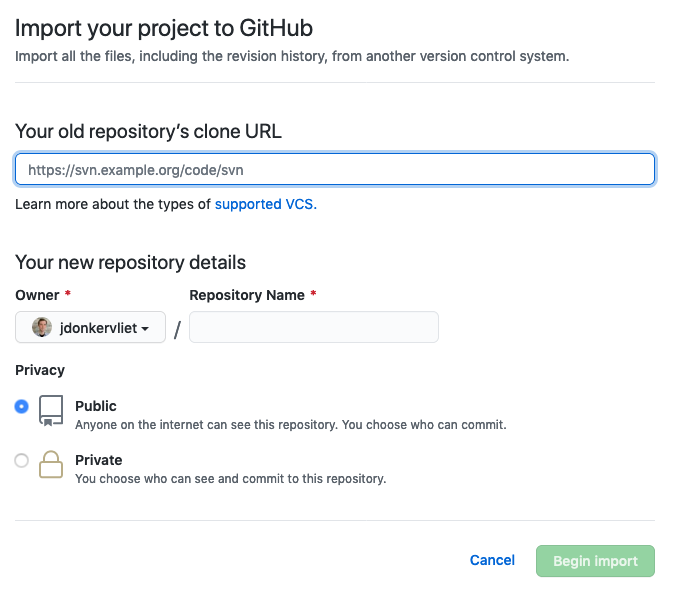

For several years, the research group I'm a part of has been using a self-hosted GitLab instance to host their software repositories.
There are clear benefits to this approach: no limits on the number of (private) repositories or amount of storage, and full control over the hardware.
However, with the hardware underlying our self-hosted instance reaching end-of-life, and limited time for maintenance, it was time to look for another solution. Fortunately, GitHub just expanded the capabilities of their [free tier](https://github.blog/2020-04-14-github-is-now-free-for-teams/). Because we already had several public projects on GitHub, we decided move from our self-hosted GitLab instance to GitHub.

Overall, I moved the repositories from GitLab to GitHub in two steps.

1. Moving 20+ repositories from GitLab to GitHub.
2. Moving issues and merge requests from roughly 3 GitLab repositories to GitHub.

# Moving Git Repositories from GitLab to GitHub

After migrating the first few repositories by hand,[^1] I found out you can import existing repositories quickly using [GitHub's import tool](https://github.com/new/import). With this tool, you only need to submit a URL pointing to the original repository and the desired name of the new repository.



Unfortunately, I quickly ran into trouble using this method. Most of our GitLab repositories are only visible to registered users. To read the repository, the user needs to log in. Although GitHub's import tool registered this and asked for my credentials, the result was the following message:

>  No source repositories were detected at \<repo_url>. Please check the URL and try again. 

Because I know the repo URL to be correct, it took a while before I figured that my two-factor authentication (2FA) was the issue. Thank you, error message!

To solve the problem, you can navigate to the repository you're trying to import and [create a Deploy Key](https://stackoverflow.com/a/54743698/2094999). You can then use this key as your login.
This approach requires you to create a Deploy Key for every imported repository. Because I was moving 24 repositories, I decided to simply temporarily deactivate 2FA.

# Moving Merge Requests and Issues from GitLab to GitHub

Because many repositories belonged to single developers, only a few repositories contained merge requests (and issues). Whereas [GitLab's import tool](https://docs.gitlab.com/ee/user/project/import/github.html) imports a GitHub repository including its pull requests, issues, wikis, and other data, GitHub's importer only imports the barebones Git repository.

Because I did not want to lose data, I searched the Internet for third-party tools that can do the job. I quickly found [node-gitlab-2-github](https://github.com/piceaTech/node-gitlab-2-github), which works reasonably well. Among other things, it allows you to import issues and pull requests. It can also map GitLab usernames to GitHub usernames, which prevents @-mentions from breaking. Its README is clear, and the process is straightforward. Get access tokens for both GitLab and GitHub, fill in the `settings.ts` file, and let the script do its work.

[^1]: ```git remote add github <repo_url> && git push --mirror github```
