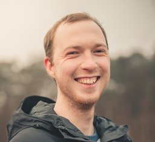

+++
menus = 'main'
title = 'About'
weight = 1
+++

I am a PhD student in the [AtLarge Research Group](https://atlarge-research.com/) and teacher at the [Vrije Universiteit (VU) Amsterdam](https://vu.nl/nl).

My research focuses on creating large-scale modifiable virtual environments (e.g., Minecraft and Roblox).
These environments are challenging to scale up due to simultaneous low-latency and high-consistency requirements.
During my PhD, I worked on tunable consistency, serverless computing (e.g., AWS Lambda), and system benchmarking.
I have also done work on performance evaluation of virtual reality (VR) devices.  
[More about my research](/research)

As a teacher at VU, my main responsibilities are teaching the Computer Networks course, and supervising students for their bachelor's and master's theses. I also teaching in the Distributed Systems course in the Computer Science master program.
I taught Computer Networks together with Andrew S. Tanenbaum, and created new end-of-chapter exercises for the 6th edition of his [Computer Networks book](https://computernetworksbook.com/).
Videos of our lectures are available on the same site.
You can find my lecture slides on my [teaching page](/teaching).  
[More about my teaching](/teaching)